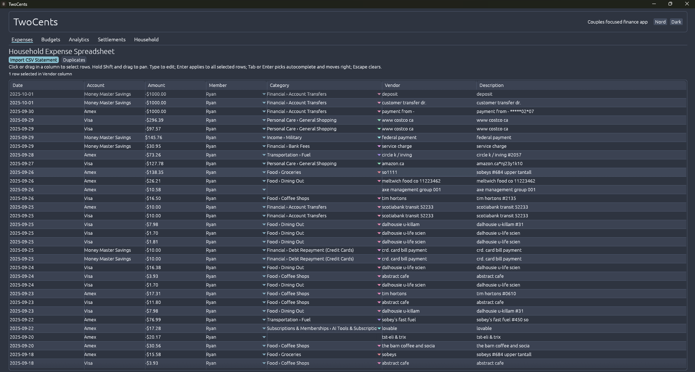
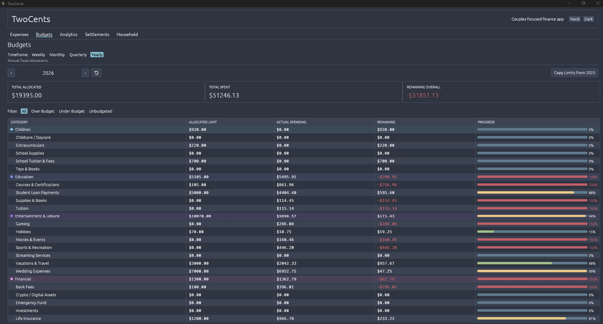
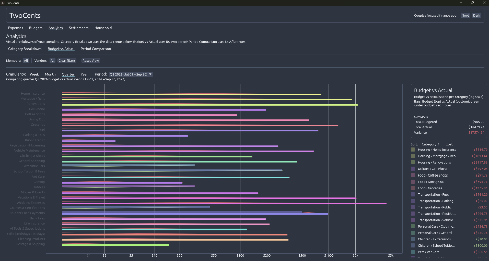
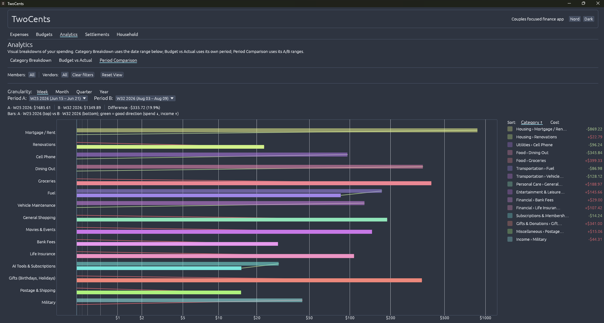
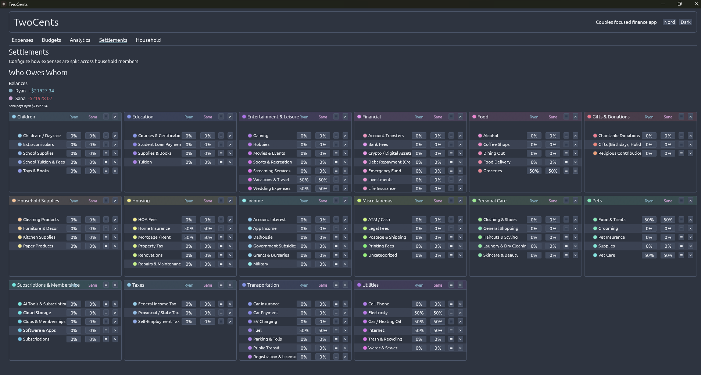
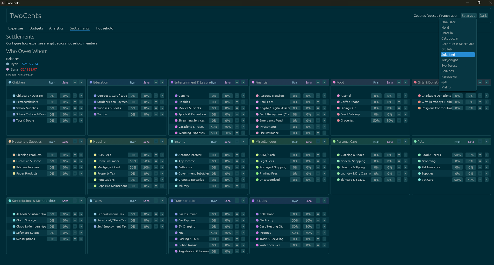

# TwoCents

<p align="center">
  
</p>

**TwoCents** is a local-first personal finance desktop app built for couples. Track shared expenses in a spreadsheet-grade grid, split every category between partners, budget with envelope-style allocations, and see exactly who owes whom — all fully offline, stored in a single SQLite file on your own machine. No accounts, no cloud, no subscription.

   

<!-- TODO: demo video embed goes here -->

---

## Why TwoCents

Shared finances are messy: two people, dozens of accounts, hundreds of transactions, and no shared source of truth. TwoCents gives couples one fast, keyboard-driven surface for the whole picture:

- **Your data stays yours** — everything lives in `%APPDATA%\TwoCents\twocents.sqlite`. The app makes zero network calls.
- **Spreadsheet speed** — a virtualized grid that stays smooth with thousands of rows, with inline editing, autocomplete, and multi-row operations.
- **Couples math built in** — per-category split percentages between partners, live balances, and minimal "who pays whom" settlements.
- **Envelope budgets** — weekly/monthly/quarterly/yearly allocations with automatic propagation and progress at a glance.

## Features

### Expenses — Household Expense Spreadsheet
A single high-performance grid shared by the main expense sheet and the import review modal:

- Inline editors for date (with picker), amount, member, category, vendor, description, and account.
- Typeahead autocomplete with group headers for Members, Categories, Vendors, and Descriptions.
- Multi-row selection: click or drag a column, Shift+drag to pan, copy/paste, and bulk edit — Enter applies an edit to every selected row.
- Full keyboard navigation: arrows, Tab/Shift-Tab, Escape to cancel.

### CSV Statement Import
- Import a bank-exported CSV statement, review every staged row side by side, and resolve duplicates before anything touches your ledger.
- A dedicated **Duplicates** view for auditing existing data.

### Budgets
- Envelope-style limits at **Weekly / Monthly / Quarterly / Yearly** granularity, per category.
- Editing one limit automatically propagates across periods and granularities.
- **Copy Limits from…** previous period or year in one click.
- Live progress bars with color states (green → yellow → red), plus over/under/unbudgeted filters.
- Year-honest pricing: analytics always price the exact period you're viewing.

<p align="center"></p>

### Analytics
Three complementary views over the same shared filters (members, vendors, dates):

- **Category Breakdown** — donut chart with a synchronized, clickable category legend.
- **Budget vs Actual** — paired horizontal bars per category on a log dollar axis, with per-bar tooltips showing budget, actual, and signed variance.
- **Period Comparison** — any two periods A vs B (week/month/quarter/year) with direction-colored connectors and a signed difference summary.
- Shared **Category / Cost** sort across all three charts.

<p align="center"></p>
<p align="center"></p>

### Settlements
- Assign **split percentages per category** (e.g. Groceries 50/50, Fuel 70/30) with equal-split and clear shortcuts.
- Live **balances** per member over all split-covered expenses.
- Minimal **who-owes-whom** settlement suggestions.

<p align="center"></p>

### Theming
- **13 presets** — One Dark, Nord, Dracula, Catppuccin (Mocha & Macchiato), GitHub, Solarized, Tokyonight, Everforest, Gruvbox, Kanagawa, Ayu, Matrix.
- **Dark / Light / System** variants, each hand-tuned per preset.
- **Live hover preview** in the theme menu and a persisted choice across restarts.
- One internal palette source: every color in the UI derives from the active theme.

<p align="center"></p>

## Install

### Windows — one-liner
Requires no Rust toolchain — downloads the latest release binary and adds a Start-Menu shortcut:

```powershell
irm https://raw.githubusercontent.com/Nucletheus/TwoCents/main/install.ps1 | iex
```

Installs to `%LOCALAPPDATA%\TwoCents` with a **TwoCents** shortcut in your Start Menu.

### Build from source
Prerequisites: the [Rust toolchain](https://rustup.rs/) (stable) and, on Windows, Visual Studio Build Tools (MSVC target).

```powershell
git clone https://github.com/Nucletheus/TwoCents.git
cd TwoCents
cargo run --release
```

For convenience on Windows, `restart_app.bat` rebuilds and relaunches in one double-click.

## Getting Started

1. Launch the app — it creates its database on first run.
2. **Household** tab → add household members (this drives splits and balances).
3. **Expenses** → add rows manually or **Import CSV Statement** to load a bank export.
4. **Settlements** → set split percentages per category.
5. **Budgets** → pick a timeframe, allocate limits, watch the progress bars.
6. **Analytics** → pick a chart, hover the bars for dollar-level tooltips.

Your data is a single file: `%APPDATA%\TwoCents\twocents.sqlite` — back it up, move it, encrypt it; it's yours.

## Tech Stack

| | |
|---|---|
| **Language** | Rust (Edition 2021) |
| **GUI** | [egui](https://github.com/emilk/egui) + [eframe](https://github.com/emilk/egui/tree/master/crates/eframe) (immediate-mode, GPU-rendered) |
| **Charts** | [egui_plot](https://github.com/emilk/egui/tree/master/crates/egui_plot) |
| **Database** | SQLite via [rusqlite](https://github.com/rusqlite/rusqlite) (bundled, static linking) |
| **Time** | [chrono](https://github.com/chronotope/chrono) & [jiff](https://github.com/burntsushi/jiff) |
| **Extras** | egui_extras (date picker), custom virtualized grid |

## Project Structure

```
src/
├── main.rs          # App state, budget pricing engine, window/event plumbing
├── models.rs        # Domain structs + shared GridRow trait
├── db.rs            # SQLite schema, migrations, queries
└── ui/
    ├── theme.rs     # Presets, derived palette — the single color source
    ├── components.rs# Chrome builders (cards, buttons, inputs, progress)
    ├── grid.rs      # The unified spreadsheet engine
    ├── expenses.rs / budgets.rs / settlements.rs / households.rs
    ├── import_modal.rs / duplicates_modal.rs / popups.rs / widgets.rs
    └── analytics/   # Category breakdown, Budget vs Actual, Period Comparison
```

## License

Copyright © 2026 Nucletheus. All rights reserved.

Source is provided for review and personal use; redistribution or reuse requires permission.
