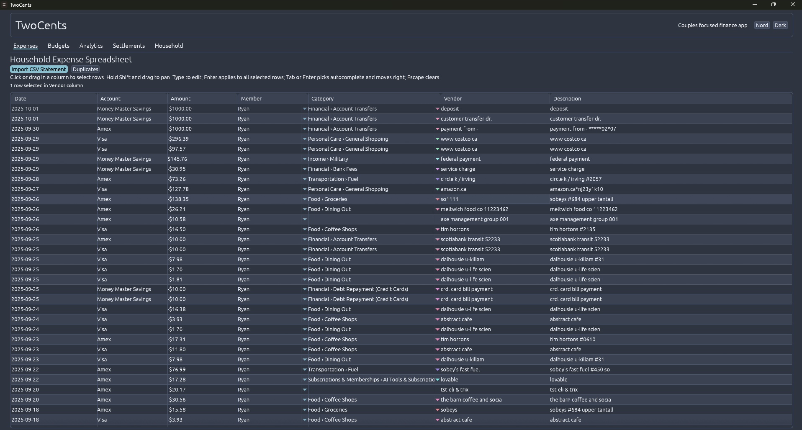
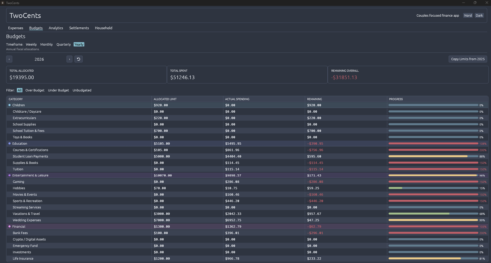
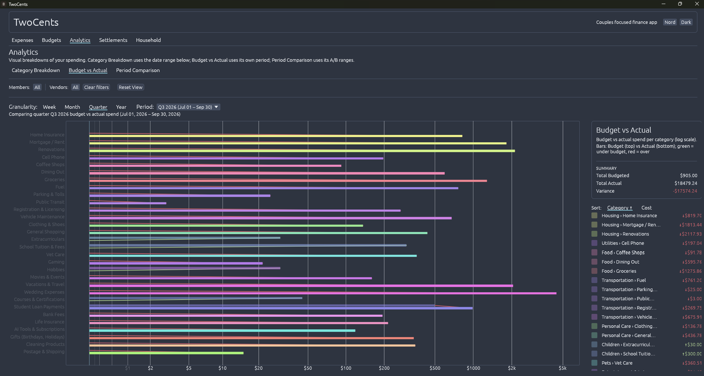
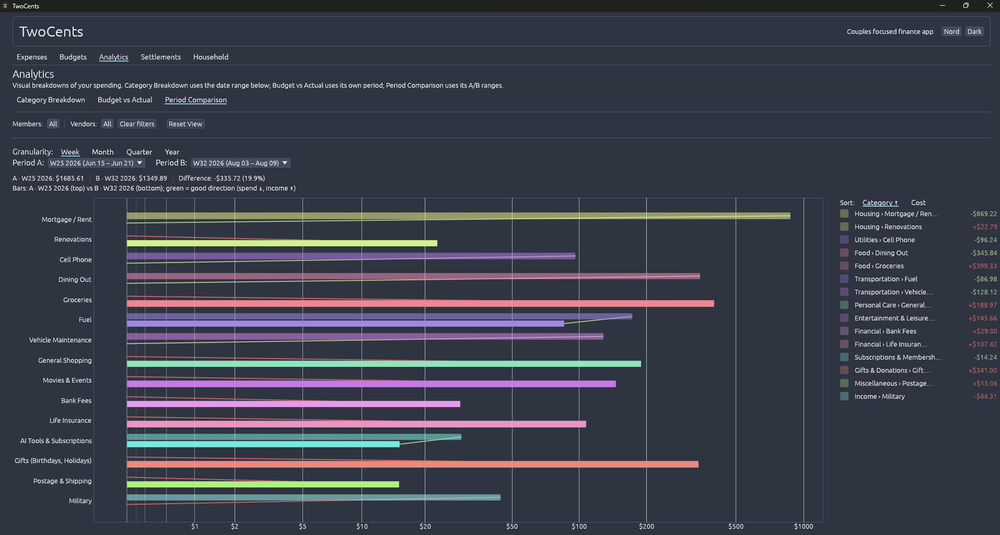
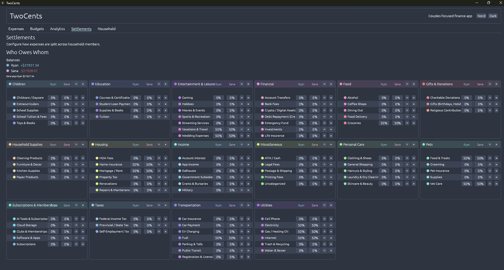
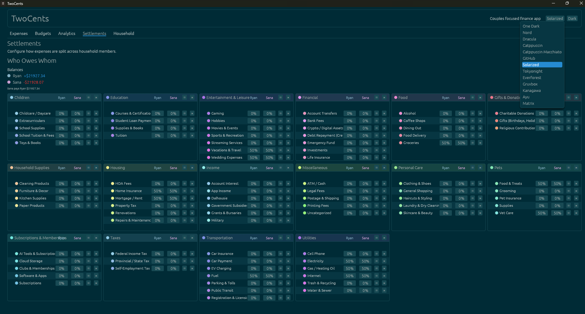

# TwoCents

<p align="center">
  
</p>

[](https://www.buymeacoffee.com/Nucletheus)

<p align="center">
  
</p>

TwoCents is a personal finance desktop app for couples. It tracks shared expenses, splits categories between household members, manages budgets, and calculates who owes whom. It runs fully offline and stores everything in one local SQLite file.

<p align="center">
  
  
  
  
</p>

## About this project

This is a personal project and a minimum viable product, built for my own household. It works, but expect rough edges, limited features, and changes along the way. If you find it useful, consider buying me a coffee with the link at the top of the repo.

## Features

### Expenses
A spreadsheet-style grid shared by the expense sheet and the import review modal:

- **Add expense** drops a new row into the grid on today's date, filed under the default member, and puts the cursor in the description cell.
- Inline editors for date (with picker), amount, member, category, vendor, description, and account.
- Autocomplete with suggestions for members, categories, vendors, and descriptions.
- Multi-row selection: click or drag a column, Shift+drag to pan, copy/paste, and bulk edit. Enter applies an edit to every selected row.
- Keyboard navigation: arrow keys, Tab/Shift-Tab, Escape to cancel.

### CSV import
- Import a bank-exported CSV statement and review every staged row before it is saved.
- Resolve duplicates during review, or audit existing data in the Duplicates view.

### Budgets
- Per-category limits at weekly, monthly, quarterly, or yearly granularity.
- Yearly caps catch up against spending already recorded earlier in the year, then allocate the remainder across the remaining periods.
- Monthly, quarterly, and weekly edits apply from the selected period through the end of the year and update the yearly cap consistently.
- Copy Limits clones the complete previous calendar-year plan when you explicitly want to carry it forward.
- Progress bars per category with over/under/unbudgeted filters.
- Budget prices are year-scoped, so viewing a past year never borrows the current year's numbers.

<p align="center"></p>

### Analytics
Three chart views over the same filters (members, vendors, dates):

- **Category Breakdown**: donut chart with a clickable category legend.
- **Budget vs Actual**: paired horizontal bars per category on a log dollar axis. Tooltips show budget, actual, and the signed variance.
- **Period Comparison**: compare any two periods with direction-colored connectors and a signed difference.
- One shared Category/Cost sort applies across all three charts.

<p align="center"></p>
<p align="center"></p>

### Settlements
- Assign split percentages per category (for example, Groceries 50/50, Fuel 70/30), with equal-split and clear shortcuts.
- Live balance per member over all split-covered expenses.
- Minimal who-owes-whom payment suggestions.

<p align="center"></p>

### Household
- Manage household details, members, and categories from one responsive panel.
- Mark the default member clearly and keep category membership easy to scan.
- Rename, recolor, remove, and restore shared household changes with persistent undo history.
- Destructive actions use compact confirmations while the surrounding app remains visible.

### Theming
- 13 presets: One Dark, Nord, Dracula, Catppuccin (Mocha and Macchiato), GitHub, Solarized, Tokyonight, Everforest, Gruvbox, Kanagawa, Ayu, Matrix.
- Dark, light, and follow-system variants for each preset.
- Hovering a preset previews it live; the choice is saved and restored on restart.
- All colors in the app come from one palette in the theme module.

<p align="center"></p>

## Install

Everything the app owns lives in one folder: the executable and its `data`
subfolder (the SQLite database plus the saved window state). Nothing is written
to `%APPDATA%`, `%TEMP%`, or your documents, so deleting the install folder
removes the app and all its data.

### Current user
Installs to `%LOCALAPPDATA%\TwoCents` and adds a Start Menu shortcut:

```powershell
irm https://raw.githubusercontent.com/Nucletheus/TwoCents/main/install.ps1 | iex
```

Close the app before running the installer again; it refuses to update a running
install. Updates replace only the application files and never touch `data`.

> **SmartScreen note:** the Windows binary is not code-signed, so the first launch may show "Windows protected your PC". Click **More info → Run anyway** to proceed, or verify the download against the release artifacts. The installer checks the release asset's SHA-256 digest when GitHub publishes one.

### Uninstall

Close the app, delete `%LOCALAPPDATA%\TwoCents`, and delete the `TwoCents` Start
Menu shortcut. Back up `<install>\data\twocents.sqlite` first if you want your
history.

### Build from source
Requires the [Rust toolchain](https://rustup.rs/) (1.85+ stable) and, on Windows,
Visual Studio Build Tools (MSVC target) with a C compiler — `rusqlite` builds
SQLite from C source.

```powershell
git clone https://github.com/Nucletheus/TwoCents.git
cd TwoCents
cargo run --release
```

`cargo run` keeps its data in `target\release\data`, since the data folder is
always resolved next to the executable.

## Getting Started

1. Launch the app. It creates `%LOCALAPPDATA%\TwoCents\data\twocents.sqlite` on
   first run, along with a `My Household` household, a default member named
   `Me`, and a full category tree (housing, groceries, utilities, income, and
   more) that you can rename, recolor, or delete.
2. Household tab: rename the household and the default member, then add anyone
   else. The default member is the one new expenses and CSV imports are filed
   under.
3. Expenses: press **Add expense** to type a row straight into the grid (it
   starts on today's date under the default member), or **Import CSV
   Statement** to review a bank export before saving it.
4. Settlements: set split percentages per category once there are two members.
5. Budgets: pick a timeframe and allocate limits.
6. Analytics: pick a chart and hover the bars for tooltips. Charts start on
   All Time so a fresh import of older statements still shows up.
7. Household tab: if TwoCents is useful to you, there is a Buy Me a Coffee link under Support.

All data lives in one file: `<install dir>\data\twocents.sqlite`. Copy that file
to back it up or move the whole install folder to another machine. Updating from
an older version that stored data in `%APPDATA%\TwoCents` is automatic: the
database is snapshotted into the install folder, verified, and the old copy is
renamed to `twocents.sqlite.migrated.bak`.

## Tech Stack

| Component | Library |
|---|---|
| Language | Rust (Edition 2021) |
| GUI | [egui](https://github.com/emilk/egui) + [eframe](https://github.com/emilk/egui/tree/master/crates/eframe) |
| Charts | [egui_plot](https://github.com/emilk/egui/tree/master/crates/egui_plot) |
| Database | SQLite via [rusqlite](https://github.com/rusqlite/rusqlite) (bundled) |
| Time | [chrono](https://github.com/chronotope/chrono), [jiff](https://github.com/burntsushi/jiff) |
| Extras | egui_extras (date picker), custom virtualized grid |

## Project Structure

```
src/
├── main.rs          # App state, window/event plumbing, and UI orchestration
├── budget.rs        # Year-scoped budget planning and allocation rules
├── models.rs        # Domain structs and the shared GridRow trait
├── db.rs            # SQLite schema, migrations, queries
└── ui/
    ├── mod.rs       # Tab dispatch
    ├── theme.rs     # Presets and the derived palette, the single color source
    ├── theme_tokens.rs # Shared spacing/typography tokens
    ├── components.rs# Chrome builders: cards, buttons, inputs, progress bars
    ├── grid.rs      # The unified spreadsheet engine
    ├── expenses.rs / budgets.rs / settlements.rs / households.rs
    ├── import_modal.rs / duplicates_modal.rs / popups.rs / widgets.rs
    └── analytics/   # Category breakdown, Budget vs Actual, Period Comparison
```

## License

Copyright © 2026 Nucletheus. All rights reserved.

Source is provided for review and personal use; redistribution or reuse requires permission.
